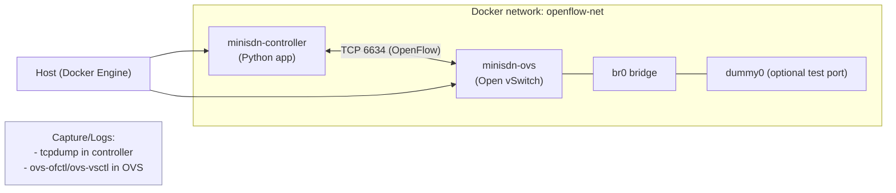

# Documentation

minisdn-controller の詳細ドキュメントへの入口です。セットアップからテスト、トラブルシュートまでを `docs/` 配下にまとめています。

## 目次
- [クイックスタート](#クイックスタート)
- [ネットワーク概要](#ネットワーク概要)
- [セットアップと使い方](#セットアップと使い方)
- [テストガイド](#テストガイド)
- [トラブルシュート](#トラブルシュート)
- [参考リソース](#参考リソース)

## クイックスタート
最短で試すには README の手順を参照してください。詳細手順は「セットアップと使い方」にまとめています。

## ネットワーク概要
`docker-compose` で controller / OVS を同一ブリッジネットワーク (`openflow-net`) に配置し、OpenFlow (TCP 6634) で接続します。`make test-manual` などはこの構成をそのまま利用します。

## セットアップと使い方
- `docs/how-to.md` に、環境準備からコントローラー起動、Open vSwitch との接続手順をまとめています。

## テストガイド
- ユニット/統合/パケットキャプチャテストの実行方法は `docs/how-to.md#4-テストの実行` を参照してください。

## トラブルシュート
- Docker のクリーンアップやポート競合への対処は `docs/how-to.md#5-トラブルシュート` を参照してください。

## 参考リソース
- デモ画像: `docs/demo.png`（必要に応じて資料や README から参照してください）

